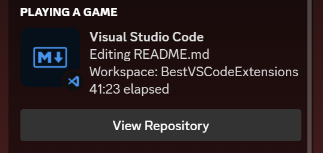

# BestVSCodeExtensions

a handful of my favs.

i use all of these on pretty much a daily basis, so i figured i'd share them with you all.

## Table of Contents

- [Language Specific Extensions](#language-specific-extensions)
  - [Extensions for Java](#extensions-for-java)
  - [Extensions for Python](#extensions-for-python)
  - [Extensions for HTML](#extensions-for-html)
  - [Extensions for CSS](#extensions-for-css)
- [General Handy Extensions](#general-handy-extensions)
  - [Git Extensions](#git-extensions)
  - [Formatting Extensions](#formatting-extensions)
  - [Quality of Life Extensions](#quality-of-life-extensions)
  - [Nerdy Extensions](#nerdy-extensions)
- [Themes](#themes)
  - [Color Themes](#color-themes)
  - [Icon Themes](#icon-themes)

# Language Specific Extensions

## Extensions for Java

### [Java Extension Pack](https://marketplace.visualstudio.com/items?itemName=vscjava.vscode-java-pack)

> A schmack ton of handy extensions for Java development

### [Javadoc Tools](https://marketplace.visualstudio.com/items?itemName=madhavd1.javadoc-tools)

> Generate Javadocs for all your Java-ing.

### [Getter and Setter Generator](https://marketplace.visualstudio.com/items?itemName=afmicc.GetterAndSetterGenerator)

> Generate getters and setters for all your Java-ing.

## Extensions for Python

### [Python Extension Pack](https://marketplace.visualstudio.com/items?itemName=ms-python.python)

> A schmack ton of handy extensions for Python development
### [AutoDocstring](https://marketplace.visualstudio.com/items?itemName=njpwerner.autodocstring)

> Automatically generate docstrings for Python functions

## Extensions for HTML

### [Live Server](https://marketplace.visualstudio.com/items?itemName=ritwickdey.LiveServer)

> Lets you run a local server that updates as you save your files

## Extensions for CSS

### [CSS Peek](https://marketplace.visualstudio.com/items?itemName=pranaygp.vscode-css-peek)

> Peek to CSS definitions from HTML and JS files

# General Handy Extensions

## Git Extensions

### [GitLens](https://marketplace.visualstudio.com/items?itemName=eamodio.gitlens)

> The best Git extension for VSCode. Period.

## Formatting Extensions

### [Prettier](https://marketplace.visualstudio.com/items?itemName=esbenp.prettier-vscode)

> Automatically formats your code to look pretty (for all you terrible indenters)

_(a tip for this one: go `file > preferences > settings` and search for `format on save`. you're welcome)_

## Quality of Life Extensions

### [Code Runner](https://marketplace.visualstudio.com/items?itemName=formulahendry.code-runner)

> `ctrl+alt+n` to run your code in the terminal. Flakey with Java, but works great with Python

### [Error Lens](https://marketplace.visualstudio.com/items?itemName=usernamehw.errorlens)

> Makes it easier to see where your errors are

## Nerdy Extensions

### [vscode-spotify](https://marketplace.visualstudio.com/items?itemName=shyykoserhiy.vscode-spotify)

> If alt-tabbing to Spotify is too much work for you

### [Discord Presence](https://marketplace.visualstudio.com/items?itemName=icrawl.discord-vscode)

> For all you Discord nerds out there (_cough cough dylan cough cough_)

# Themes

## Color Themes

### [Dracula](https://marketplace.visualstudio.com/items?itemName=dracula-theme.theme-dracula)

> I use this one!

### [Atom One Dark](https://marketplace.visualstudio.com/items?itemName=akamud.vscode-theme-onedark)

> This one's pretty nice

### [Min Theme](https://marketplace.visualstudio.com/items?itemName=miguelsolorio.min-theme)

> I used this one for a while, nice and clean

## Icon Themes

### [Material Icon Theme](https://marketplace.visualstudio.com/items?itemName=PKief.material-icon-theme)

> Makes your icons look nice

### [Nomo Dark Icon Theme](https://marketplace.visualstudio.com/items?itemName=be5invis.vscode-icontheme-nomo-dark)

> Makes your icons also look nice

